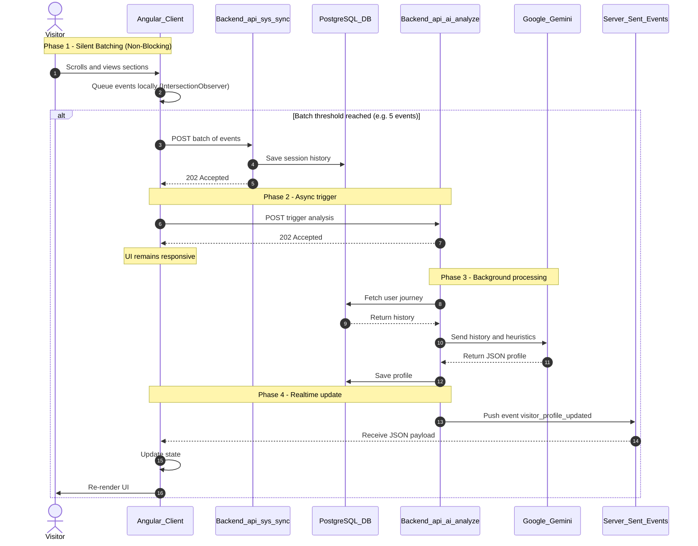

# Personal Portfolio & AI-Powered Developer Intelligence Platform

**Live Demo: [https://robert-kameni-personal-portfolio.vercel.app/](https://robert-kameni-personal-portfolio.vercel.app/)**

**A self-evolving, enterprise-grade Angular portfolio and AI-powered intelligence platform showcasing 4+ years of expertise in building scalable, high-performance web applications.**

---

## 👨‍💻 About Me

**Lucas Robert Kameni Namou**

*Technical Lead Frontend Developer - Angular Specialist*

I am an experienced Technical Lead & Frontend Expert with over 4 years of experience in modern web application development. My specialization lies in Angular (v8-v21), reactive programming, and enterprise-wide application architecture.

I am currently seeking freelance engagements for architecture consulting, complex feature development, and technical mentorship.

### Contact & Conditions

- **Email:** [robertkameni83@gmail.com](mailto:robertkameni83@gmail.com)
- **Location:** 90459 Nürnberg
- **Availability:** From 01.07.2026
- **Languages:** German (Fluent), English (Fluent), French (Native)

---

## 🤖 The AI Magic: High-Performance Adaptive UI

This isn't just a static website; it's a self-adapting intelligence platform. It uses a custom-built, highly performant event-driven architecture to figure out *what* you are looking for and *adapts* its own text to match your intent in real-time, without ever blocking the UI.

### Architectural Sequence Diagram

## Architectural Sequence Diagram

### Why is this architecture robust and performant?

1. **Intelligent Batching:** Sending a network request for every single scroll event would spam the server and hit browser rate limits. The Angular client queues events locally and sends them in lightweight batches.
2. **"Fire-and-Forget" Analysis:** When the frontend triggers an analysis, the backend instantly returns a `202 Accepted` status. The frontend **never waits** for the AI. This completely eliminates HTTP hanging and ensures the UI thread remains buttery smooth.
3. **Background Processing & SSE:** The heavy lifting (talking to Google Gemini, which takes 3-10 seconds) happens entirely in the background on the Nitro server. Once finished, the server pushes the data down an already-open, highly efficient Server-Sent Events (SSE) pipeline.
4. **Signal Reactivity:** The moment the SSE payload hits the Angular `VisitorStore`, the framework's reactive `computed()` signals instantly surgically update only the text nodes that need to change, without heavy DOM diffing.

---

## 🚀 Core Competencies

### Frontend Development

- **Framework:** Angular 21 (Signals, Standalone Components, Directives)
- **State Management:** NgRx, Signal Store, RxJS (Advanced Patterns)
- **UI Frameworks:** Tailwind CSS, Angular Material, Bootstrap, AG-Grid, Native CSS
- **Testing:** Vitest (Unit), Angular Vitest Builder
- **Performance:** SSR, PWA, Lazy Loading, Change Detection Optimization, Bundle Analysis

### Software Development Expertise

- **Architecture & Design Patterns:** TypeScript/RxJS, Clean Code, SOLID Principles
- **Performance Optimization:** Reduction of regression bugs and runtime errors
- **Enterprise Security & Accessibility:** WCAG 2.1 Compliance Automation
- **Technical Leadership:** Code Reviews, Pair Programming, Team Coordination

### Enterprise & DevOps

- **Backend Integration:** RESTful APIs, OpenAPI Specifications, JSON/XML
- **Backend Knowledge:** Java, Spring Boot 3
- **DevOps & Tools:** Docker, Git Flow, Jenkins, Jira, Confluence, Postman, GitHub
- **Architecture Patterns:** Monorepo (Nx)

### Soft Skills

- Technical Leadership & Mentorship
- Agile/Scrum Methodologies
- Architecture & Code Reviews
- Structured and Fast-Paced Problem Solving
- Excellent Communication & Team Collaboration
- Empathetic and Quick Learner

---

## 🌟 About This Project (Technical Stack)

This isn't just a static portfolio. It's a full-stack application built with a modern, enterprise-ready architecture. It demonstrates advanced concepts and best practices in the Angular ecosystem.

### Key Project Features

- **AI-Powered Analytics:** (See the AI Magic section above).
- **Dynamic CMS:** A complete Content Management System for projects, managed through a secure admin dashboard.
- **Advanced Angular:** Built with Angular 21, utilizing Standalone Components, Signals for state management, and Server-Side Rendering (SSR) for optimal performance.
- **Enterprise-Grade Backend:** A robust backend powered by Nitro, H3, and Prisma ORM, handling authentication, data persistence, and API services.
- **Secure Authentication:** JWT-based authentication with access/refresh token strategy and secure `httpOnly` cookies.

### Technical Stack

| Area               | Technologies                                                  |
|--------------------|---------------------------------------------------------------|
| **Frontend**       | Angular 21, TypeScript, RxJS, NgRx Signal Store, Tailwind CSS |
| **Backend**        | Nitro, H3 (Server Engine), Prisma ORM                         |
| **Database**       | PostgreSQL (Neon Postgres)                                    |
| **AI & Analytics** | Google Gemini, Custom Analytics Engine                        |
| **Testing**        | Vitest (Unit)                                                 |
| **DevOps**         | Vercel (Deployment)                                           |
