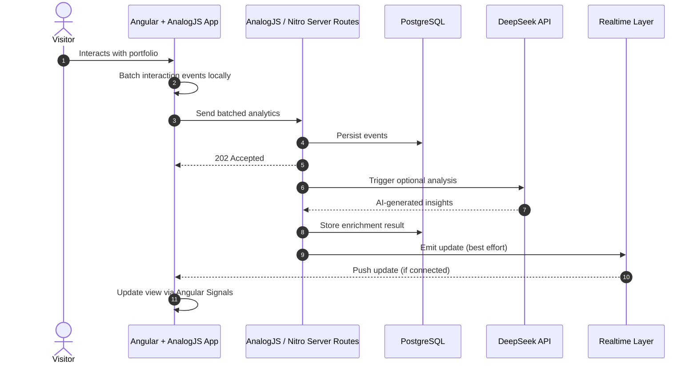

# Personal Portfolio & AI Showcase

**Live demo:** [https://robert-kameni-personal-portfolio.vercel.app/](https://robert-kameni-personal-portfolio.vercel.app/)

An **Angular 22 + AnalogJS-based portfolio** demonstrating modern frontend architecture, lightweight server-side capabilities, and optional AI-driven UI personalization.

The project showcases how **Angular 22 (Signals, stable Resource API, Signal Forms, SSR, standalone components)** combined with **AnalogJS server routes (Nitro runtime)** can deliver a fast, reactive, and content-adaptive user experience without requiring a separate backend system.

---

## 👨‍💻 About This Project

This is a **frontend-first engineering showcase** with a minimal, embedded backend layer.

It demonstrates practical use of:

* Angular 22 (Signals, stable Resource API, Signal Forms, OnPush-by-default, SSR, standalone architecture)
* AnalogJS (server-side rendering + file-based server routes)
* Nitro runtime (lightweight API layer inside Angular app)
* PostgreSQL (via Prisma ORM)
* DeepSeek API (AI-driven enrichment layer)
* Server-Sent Events (SSE) for optional realtime updates

The system is designed for **single-instance deployment (Vercel)** and prioritizes:

* simplicity over distributed complexity
* UX responsiveness over backend orchestration
* pragmatic architecture over infrastructure abstraction

---

## 🤖 AI-Powered UI Personalization

The portfolio includes a **non-blocking AI enrichment pipeline** that adapts content based on user interaction signals.

### Flow overview:

* User interactions are captured in the browser
* Events are batched locally for efficiency
* AnalogJS/Nitro server routes process analytics asynchronously
* Optional AI enrichment is generated via DeepSeek API
* UI updates are applied when results are available
* Angular Signals ensure minimal, targeted re-renders

This layer is **progressive enhancement**, not a core dependency.

---

## 📊 Architecture Overview



---

## ⚙️ Key Design Principles

* **Frontend-first architecture** — backend exists only to support UX
* **No blocking AI calls** — everything runs asynchronously
* **Single-instance optimized** — designed for Vercel deployment
* **Progressive enhancement model** — features degrade gracefully
* **Signal-driven UI updates** — minimal DOM work, reactive updates only
* **Optional realtime layer (SSE)** — improves UX but is not required

---

## 🧱 Technology Stack

### Frontend

* Angular 22
* Signals + stable Resource API (`httpResource`) + Signal Forms
* SSR with incremental hydration (default in v22)
* Angular CLI MCP server (`.cursor/mcp.json`) for agent fact-checking against [angular.dev](https://angular.dev)
* Standalone components
* RxJS (selective usage)
* Tailwind CSS

### Backend (embedded)

* AnalogJS (server routes)
* Nitro runtime (H3-based API layer)
* Prisma ORM

### Data

* PostgreSQL (Neon / hosted SQL)

### AI

* DeepSeek API (visitor enrichment + content adaptation)

### Realtime

* Server-Sent Events (SSE)
* Optional Redis (multi-instance enhancement only)

### Deployment

* Vercel (serverless single-instance model)

---

## 🧠 What This Project Demonstrates

This portfolio is intentionally built to show:

* modern Angular architecture beyond CRUD apps
* practical use of SSR + Signals in real applications
* lightweight backend integration without microservices
* async AI pipelines without UI blocking
* event-driven UI updates in a frontend-first system

---

## 🚀 Why AnalogJS Matters Here

AnalogJS acts as the **bridge between Angular and server capabilities**, enabling:

* server-side rendering (SSR)
* file-based API routes
* Nitro runtime execution on Vercel
* backend logic without a separate service layer

It allows this project to stay:

* **single-repo**
* **deployable without infrastructure overhead**
* **architecturally simple but expressive**

---

## 📌 Summary

This project is not a backend system.

It is a **modern Angular architecture showcase** with:

* optional AI enhancement
* lightweight server integration via AnalogJS
* reactive UI powered by Signals
* pragmatic, production-aware tradeoffs for deployment simplicity

---

## Platform Notes

### Windows prerender limitation

Local production builds on **Windows** skip static prerendering (`vite.config.ts` sets `prerender.routes` to `[]` when `process.platform === 'win32'`). CI and Vercel run on Linux and prerender public routes (`/`, `/projects`, `/projects/:slug`).

**Recommendations:**

- Use **WSL** for local prerender parity with production.
- Rely on **CI** to validate prerender output on every PR.
- A dev/build warning is printed when prerender is skipped on Windows.

### Hybrid rendering

Public project routes use **prerender**; admin routes use **client-only** rendering (`nitro.routeRules`). See `src/app/shared/routing/hybrid-render.config.ts` and per-page `routeMeta.renderMode`.

### Security operations

See [docs/security.md](docs/security.md) for JWT secret rotation and CSP Report-Only workflow.

### Bundle analysis

```bash
npm run build:analyze   # writes dist/stats.html (rollup-plugin-visualizer)
npm run check:bundles   # enforce gzip budgets after build
```